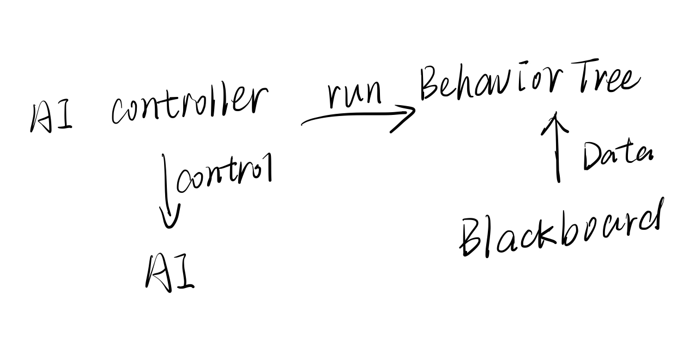
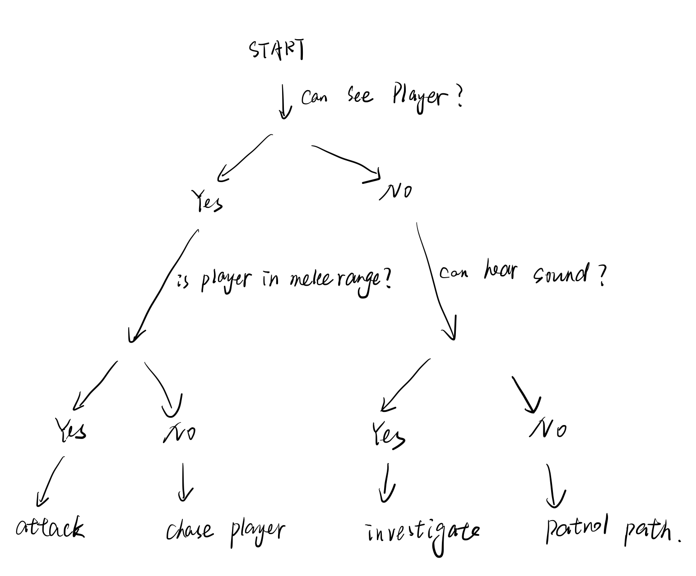
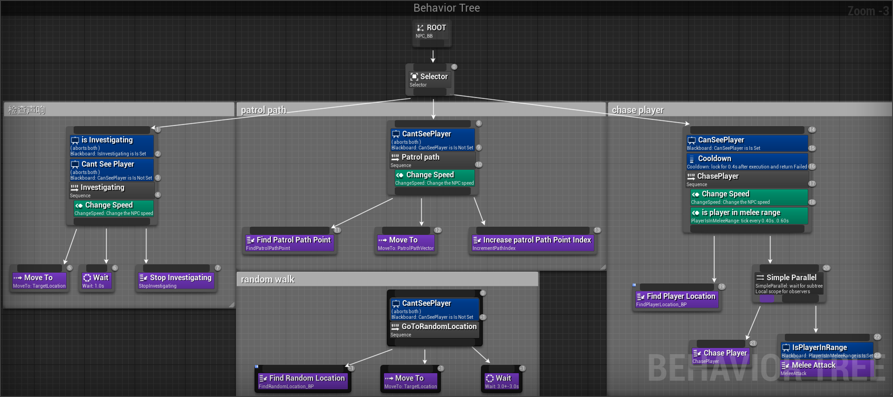

# AI

## 概念

- 黑板：行为树的数据库

- 行为树：状态模式，负责执行AI行为
- AI Controller

- AI

## 思路

## 常见节点

- root：树的根，梦开始的地方
- selector：选一个执行
- sequence：按顺序执行
- decorator：添加判断条件
- service：改变参量
- parallel：同时执行

## 遇到的问题

- 在构造函数初始化列表给血条赋值失败，但在构造函数括号里给血条赋值成功？
  - 最终原因：血条的创建在赋值之后。

- error2248 子类继承父类无法调用父类protected成员？

  - 概念不清

  - ~~~cpp
    #include <iostream>
    using namespace std;
    class Base
    {
    public:
    	Base(){};
    	virtual ~Base(){};
    protected:
    	int int_pro;
    };
    class A : public Base
    {
    public:
    	A(){};
    	A(int da){int_pro = da;}
    	void Print(A &obj){obj.int_pro = 24;}//在派生类中通过派生类对象访问，right
    	void PrintPro(){cout << "The proteted data is " << int_pro <<endl;}
    };
    int main()
    {
    	A aObj;
    	A aObj2(5);
    	aObj2.PrintPro();
    	aObj.Print(aObj2);
    	aObj2.PrintPro();
    	
       //aObj.int_pro = 8;//error,不在派生类中
    }
    ~~~

  - 总结：只有在派生类中才可以通过派生类对象访问基类的protected成员。
